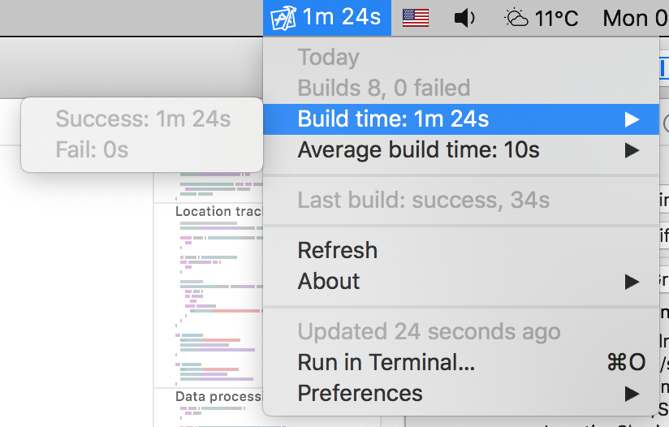

# Xcode build times


Have you even wondered how much time a day you spend waiting for Xcode to do your builds? Wonder no more, this [BitBar](https://getbitbar.com/) plugin shows the time wasted right in your menu bar.



## Installation

### BitBar installation and setup

This script works as a [BitBar](https://getbitbar.com/) plugin so you need to install BitBar first. You can download the [latest release from GitHub](https://github.com/matryer/bitbar/releases/latest) or use `brew`

```bash
brew cask install bitbar
```

On the first run select a directory you wish to use aj your plugin directory, for example `~/BitBarPlugins`.

### Plugin installation

Download the `xcodeBuildTimes.1m.php` file from the `sources` folder in this repository and place it the plugin folder and make it executable.

You can do it manually or via terminal

```bash
cd ~/BitBarPlugins
curl https://raw.githubusercontent.com/matopeto/xcode-build-times/master/sources/xcodeBuildTimes.1m.php --output xcodeBuildTimes.1m.php
chmod +x xcodeBuildTimes.1m.php
```

If you now refresh BitBar data you should see the script being loaded.

### Xcode setup

The final step is to make Xcode call the script on every build. 

To do this open `Preferences` | `Behaviors` in Xcode and set the script to `Run` when the `Build` starts


fails


and succeeds


### Optional setup

The script is called `xcodeBuildTimes.1m.php` so BitBar will refresh the data every minute. If you want to use a different refresh interval, just change the `1m` in the script name yo your desired interval. 

You can find [more info about the refresh intervals in the BitBar documentation](https://github.com/matryer/bitbar#configure-the-refresh-time).