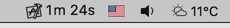

# Xcode build times



Have you ever wondered how much time a day you spend waiting for Xcode to do your builds? Wonder no more, this [SwiftBar](https://github.com/swiftbar/SwiftBar/) or [xbar](https://github.com/matryer/xbar) (the BitBar reboot) plugin shows the time wasted right in your menu bar!


### Features

- **Always in sight** - your build time sits right in the menu bar, no need to open anything
- **Know where your time goes** - daily totals, averages, and all-time stats at a glance (hold `⌥ Option` to reveal the full horror)
- **Spot the failures** - separate success and fail breakdowns so you know what's costing you
- **Filter what matters** - track only the workspaces or projects you care about
- **Share the pain** - show your teammates just how long you've been waiting
- **Your data, your way** - import, export, or back up your build history anytime
- **Always up to date** - one-click updates directly from the menu bar

## Installation

You can use this plugin with SwiftBar or xbar (the BitBar reboot).

So first install [SwiftBar](https://github.com/swiftbar/SwiftBar#how-to-get-swiftbar) or [xbar](https://github.com/matryer/xbar#get-started) (FYI: I am using SwiftBar, so some features are SwiftBar only) 

On the first run, select a directory you wish to use as your plugin directory, for example `~/SwiftBarPlugins`.

If you are using macOS Monterey or newer, you must install PHP, because it is not bundled in macOS anymore. E.g. from Homebrew: `brew install php` and you must have the path to `php` executable in PATH variable.

### Plugin installation

Download the `xcodeBuildTimes.1m.php` file from the `sources` folder in this repository, place it in the plugin folder and make it executable.

You can do it manually or via terminal:

```bash
cd ~/SwiftBarPlugins
curl https://raw.githubusercontent.com/matopeto/xcode-build-times/master/sources/xcodeBuildTimes.1m.php --output xcodeBuildTimes.1m.php
chmod +x xcodeBuildTimes.1m.php
```

Before the first usage of the plugin, you must configure it. Just run:

```bash
php xcodeBuildTimes.1m.php configure
```

If you now refresh xbar/SwiftBar data, you should see the script being loaded.

### Xcode setup

The final step is to make Xcode call the script on every build. 

#### Xcode 26 and newer

In Xcode menu open `Xcode` | `Behaviors` | `Edit Behaviors`, then select `Build` and set `Run Script` to the plugin file for sections "Starts", "Succeeds" and "Fails"


#### Older Xcode

To do this, open `Preferences` | `Behaviors` in Xcode and set the script to `Run` when the `Build` starts:


Fails:


And succeeds:


### Optional setup

The script is called `xcodeBuildTimes.1m.php`, so xbar/SwiftBar will refresh the data every minute. If you want to use a different refresh interval, just change the `1m` in the script name to your desired interval. 

You can find [more info about the refresh intervals in the xbar/SwiftBar documentation](https://github.com/matryer/xbar#configure-the-refresh-time).

## License

This project is licensed under the MIT License - see the [LICENSE](LICENSE) file for details.
